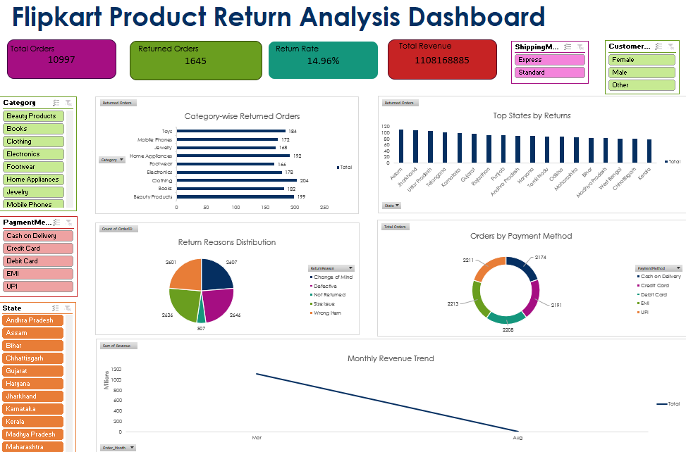

# 📊 Flipkart Product Return Analysis Dashboard (Microsoft Excel)

An end-to-end Microsoft Excel data analytics project focused on analyzing product returns, sales performance, customer behavior, and generating business insights through an interactive dashboard.

---

## 📌 Project Overview

This project analyzes Flipkart product return data using Microsoft Excel. It demonstrates the complete data analytics workflow, including data cleaning, feature engineering, Pivot Tables, Pivot Charts, KPI reporting, and dashboard development to support business decision-making.

---

## 🎯 Objective

- Analyze product return patterns.
- Monitor sales performance across different product categories.
- Identify major return reasons.
- Evaluate customer purchasing behavior.
- Build an interactive dashboard for business decision-making.

---

## 🛠️ Tools & Technologies

- Microsoft Excel
- Excel Tables
- Pivot Tables
- Pivot Charts
- Slicers
- Conditional Formatting
- Data Cleaning
- Feature Engineering

---

## 📂 Dataset Features

- Order Details
- Delivery Information
- Product Category
- Product Price
- Quantity
- Customer Demographics
- Payment Method
- Return Reason
- Warranty
- Shipping Mode
- Product Rating

---

## 🔄 Project Workflow

```text
Raw Data
      ↓
Data Cleaning
      ↓
Feature Engineering
      ↓
Pivot Table Analysis
      ↓
Interactive Dashboard
      ↓
Business Insights & Recommendations
```

---

## 🧹 Data Cleaning

- Removed duplicate records using Order ID.
- Handled missing values.
- Standardized date formats.
- Corrected inconsistent formatting.
- Converted the dataset into an Excel Table.

---

## ⚙️ Feature Engineering

Created the following calculated columns:

- Revenue
- Delivery_Days
- Return_Risk
- Order_Month

---

## 📊 Dashboard Features

### KPI Cards

- Total Orders
- Returned Orders
- Return Rate
- Total Revenue

### Charts

- Category-wise Returned Orders
- Top States by Returned Orders
- Return Reason Distribution
- Orders by Payment Method
- Monthly Revenue Trend

### Interactive Filters

- Category
- State
- Payment Method
- Shipping Mode
- Customer Gender

---

## 📷 Dashboard Preview

!## 📷 Dashboard Preview



---

## 📈 Business Insights

- Approximately **15%** of customer orders resulted in product returns.
- Electronics, Beauty Products, and Books contributed significantly to total product returns.
- Defective products, Wrong Item, and Change of Mind were among the most common return reasons.
- State-wise analysis highlighted regions with consistently higher return volumes.
- Monthly revenue trends revealed fluctuations in sales performance across different months.
- Digital payment methods such as UPI, Debit Card, and Credit Card were the most frequently used payment options.

---

## 💡 Business Recommendations

- Improve product quality inspection before shipment.
- Strengthen packaging and logistics to reduce product damage.
- Monitor high-return product categories regularly.
- Optimize operations in states with higher return rates.
- Analyze return reasons periodically to reduce avoidable returns.
- Use monthly revenue trends for inventory planning and demand forecasting.

---

## 💼 Skills Demonstrated

- Microsoft Excel
- Data Cleaning
- Data Transformation
- Feature Engineering
- Excel Tables
- Pivot Tables
- Pivot Charts
- Dashboard Design
- KPI Reporting
- Data Visualization
- Business Analysis

---

## 📁 Repository Structure

```text
Flipkart-Product-Return-Analysis-Excel/
│
├── README.md
├── Flipkart_Product_Return_Analysis_Portfolio.xlsx
├── Flipkart_Product_Return_Analysis_Report.pdf
└── Images/
    └── dashboard.png
```

---

## 📝 Note

The original project was developed using a dataset containing **300,000 records**. To comply with GitHub file size limitations, a representative sample workbook has been uploaded while preserving the complete analytical workflow, dashboard design, and business insights.

---

## 👨‍💻 Author

**Yogesh Kumar**

- GitHub: https://github.com/yogeshkumar70628
- LinkedIn: *(https://www.linkedin.com/in/yogeshkumar-data-analyst/)*
